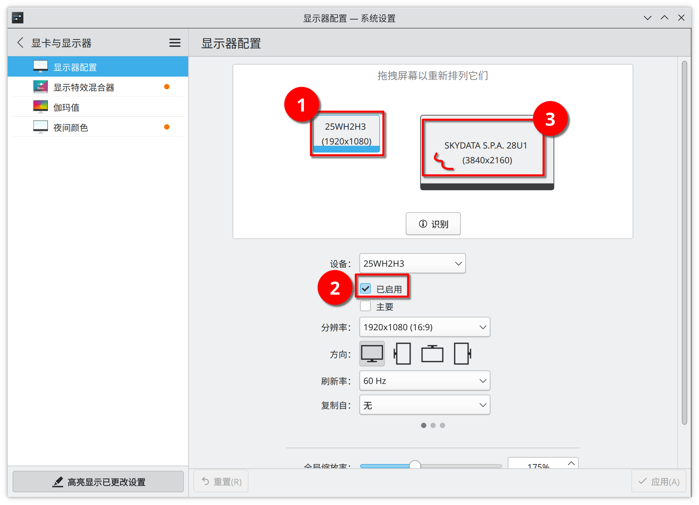

# KDE 高分屏工具

[English Version](README.md)
README优先写中文版！等我中文版写完了再说喽！

## 工具1.修改 kdeglobals

**脚本文件名:** kdeglobals.py

## 工具2.xrandr 命令生成器

**脚本文件名:** multiscreen.py

### 使用方法

#### 注意事项

使用前，必须保证要调整的屏幕处于关闭状态，也就是所有缩放倍率不是 1.0 的屏幕均需要在系统界面提前设置为关闭状态，否则程序调整过后，会发现屏幕对应屏幕只有左上角有桌面覆盖，右边以及下边都是黑色的区域，虽然可以放窗口，但是壁纸不会铺满（逼死强迫症）而且右键并不会像桌面一样弹出菜单！

### 如何关闭第二屏

**方法1.** 直接在 Python 脚本中配置后执行脚本

将您想要禁用的屏幕的 off 参数设置为 False

然后执行脚本即可！

**方法2.** 通过系统设置中的显示器配置

1. 首先选择要关闭的显示器
2. 将 已启动 前面的 √ 取消选择。
3. 拖动剩余的显示器，让左上角显示(0,0)

**方法3.** 重启大法！

毕竟本程序(方法)重启就失效了！

### 常见问题

### 关闭屏幕后可能有各种问题
如果您已经通过本脚本或者是 xrandr 配置过屏幕后，如果您要关闭某一个显示器，那么会遇到各种我都不好形容的问题。

包括但不限于：

- KDE 截图，全屏截图，会有一大块黑
- QQ 截图，有严重的 bug（这里的QQ指的是，Electron 版 QQ，也就是已经和 macOS 版 QQ 一样的新版QQ）
- 关闭某一屏幕的时候，剩余的界面可能会显示异常，卡一段时间，但是我乱点好像就恢复了

## 工具3.xrandr 有效信息提取器

**脚本文件名:** xrandr_info.py

本脚本能够提取出已经连接显示器的接口，以及该接口的最高分辨率及该分辨率下支持的所有刷新率。

### 使用方法

直接运行就可以了！

