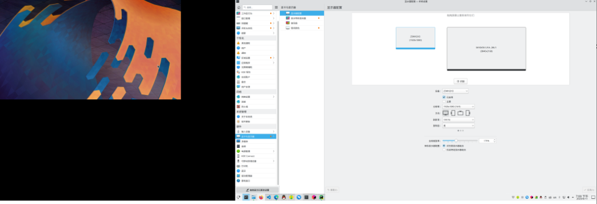

# KDE 高分屏工具

[English Version](README.md)

README优先写中文版！等我中文版写完了再说喽！

**注意：**

- 整个过程均不需要 root 权限！
- 使用本程序请先将仓库完整克隆下来！

具体计算方法可以参考
[https://zhuanlan.zhihu.com/p/636626088](https://zhuanlan.zhihu.com/p/636626088)

这篇文章中有详细的原理以及计算方法，您可以参考这篇文章内所讲述的原理来修改本脚本。

## 工具1.修改 kdeglobals(重启不失效)

**脚本文件名:** kdeglobals.py

### 使用方法

首先获取显示器名字，您可以使用 《工具3.xrandr 有效信息提取器》 获取这些信息。

通过配置 mission 变量的字典来配置您想要修改的显示器倍率。

我的配置如下，您可以做一个参考

```python
mission = {
    'DisplayPort-2': '1.75',
    'HDMI-A-2': '1'
}
```

配置好后直接执行即可！

### 原理

通过修改 ~/.config/kdeglobals 文件中的配置，修改显示器的缩放倍数。

### 注意

如果修改失败，可能是文件不可写。
请您进入终端为文件添加可写命令

```bash
chmod +w ~/.config/kdeglobals
```

## 工具2.xrandr 命令生成器(重启失效)

**脚本文件名:** x11.py

**注意：**

该方法只适合 Xorg ，并不会支持 Wayland ！！！

并且，本脚本只支持从左到右横向排列，并且上边缘对齐！

### 使用方法

Auto_Run 变量用于配置程序生成命令行后是否需要自动帮您执行。

screens 变量中存储显示器配置，请您按照从左到右的顺序，依次将您的显示器配置填写入列表中。

我的配置如下，您可以参考一下

```python
screens = [
    Screen(name='HDMI-A-2', x=1920, y=1080, scale=1.6, r="143.99", off=False),
    Screen(name='DisplayPort-2', x=3840, y=2160, scale=1.0, off=False),
]
```

这里解释一下 Screen 对象的参数：

- name 为显示器的名称
- x 为物理分辨率的长
- y 为物理分辨率的宽
- scale 为缩小倍数，off 为显示器是否关闭，False 为启用。
- r 屏幕刷新率

配置完成后
直接执行脚本即可！

推荐保存成一个 x11multiscreen.desktop 文件并防止在桌面，方便每次使用！

我的配置如下，仅供参考！
```ini
[Desktop Entry]
Version=1.0
Encoding=UTF-8
Type=Application
Categories=Settings;
Terminal=false
GenericName=X11MultiScreen
GenericName[zh_CN]=X11多屏幕
Comment=X11MultiScreen
Comment[zh_CN]=X11多屏幕
Name=X11MultiScreen
Name[zh_CN]=X11多屏幕
Icon=preferences-system
Exec=python3 "/home/konghaomin/KDEHighDPI/x11.py"
```

#### 注意事项

使用前，必须保证要调整的屏幕处于关闭状态，也就是所有缩放倍率不是 1.0
的屏幕均需要在系统界面提前设置为关闭状态，否则程序调整过后，会发现屏幕对应屏幕只有左上角有桌面覆盖，右边以及下边都是黑色的区域，虽然可以放窗口，但是壁纸不会铺满（逼死强迫症）而且右键并不会像桌面一样弹出菜单！

下图为正常情况，因为左边显示器分辨率较小，因此下方未填充满的区域截图的时候会补充成黑色区域，Wayland 环境下左下角是透明的。


下图为有问题的情况，只有有壁纸覆盖的地方可以当做桌面可以右键点击，您需要先关闭缩放比例不为 1.0 的显示器，然后直接使用脚本，脚本会帮助您重新开启显示器！
新版本脚本已经支持自动执行这个过程！


### 如何关闭第二屏

**方法1.** 直接在 Python 脚本中配置后执行脚本

将您想要禁用的屏幕的 off 参数设置为 False

然后执行脚本即可！

注意：如果您要关闭第一屏，也就是所有目前有效的屏幕中的第一个，请您先将屏幕放到后面，以免关闭屏幕后右边会有一片黑色区域，
您虽然看不出来，但是可以通过全屏幕截图的方法观察到，鼠标拖动到右边有可能会吞掉你的鼠标，你需要往左边拉很多下！
举个例子，我有两块屏幕，我的左边屏幕为副屏，我偶尔需要关闭这块副屏，因此我需要先将副屏移动到右边，即交换两个显示器的配置顺序，然后再给副屏显示器一个关闭的参数。

**方法2.** 通过系统设置中的显示器配置

1. 首先选择要关闭的显示器
2. 将 已启动 前面的 √ 取消选择。
3. 拖动剩余的显示器，让左上角显示(0,0)


**方法3.** 重启大法！

毕竟本程序(方法)重启就失效了！

### 常见问题

### 关闭屏幕后可能有各种问题

如果您已经通过本脚本或者是 xrandr 配置过屏幕后，如果您要关闭某一个显示器，那么会遇到各种我都不好形容的问题。

包括但不限于：

- KDE 截图，全屏截图，会有一大块黑
- QQ 截图，有严重的 bug（这里的QQ指的是，Electron 版 QQ，也就是已经和 macOS 版 QQ 一样的新版QQ）
- 关闭某个屏幕的时候，剩余的界面可能会显示异常，卡一段时间，但是我乱点好像就恢复了

### 遇到问题

遇到问题可以尝试执行下列命令，重启 plasma shell 。
无需过多担心会出现问题，因为 plasma shell 是支持热重启的。

```bash
kquitapp5 plasmashell && kstart5 plasmashell
```

## 工具3.xrandr 有效信息提取器

**脚本文件名:** xrandr_info.py

本脚本能够提取出已经连接显示器的接口，以及该接口的最高分辨率及该分辨率下支持的所有刷新率。

### 使用方法

直接运行就可以了！

